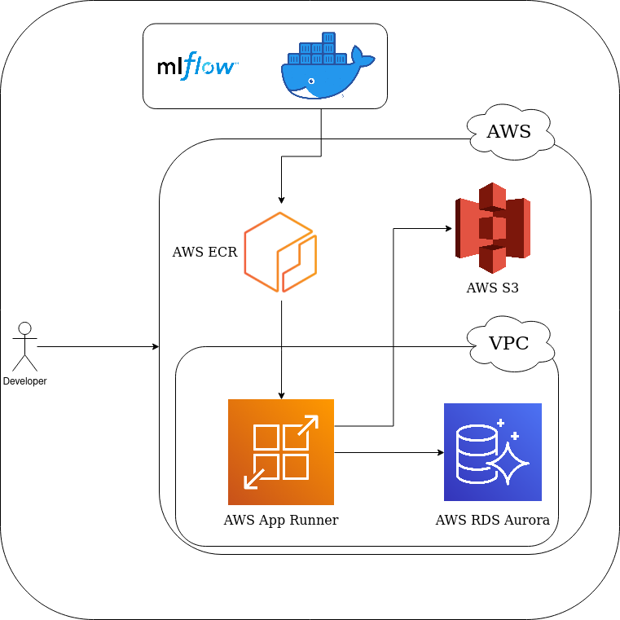

# Deploying MLFlow on AWS

This repository contains Terraform configuration files, to deploy an MLFlow server on AWS, and a bash script to deploy this server from a Linux workstation.

## Design of Infrastructure

To run an MLFlow server on AWS, we use a total of three different services:
  * AWS App Runner
  * Amazon RDS
  * Amazon S3

When we deploy an MLFlow Tracking Server, it exposes an API to two main components for storing data. They are the following:
  * A backend store
  * An artifact store
	
The backend store consists of data such as logging parameters, metrics, experiments, and metadata about experiment runs. Therefore, to store this data, we use Amazon RDS as the backend store. In particular, we use Amazon Aurora Serverless, using the PostgreSQL engine. 

In addition to the data generated from the backend store, the artifact store persists of data such as models, data files, images, and so on. Since this data is generally large and consists of different objects, we use an Amazon S3 bucket to hold this data.

To deploy the MLFlow server and its user interface, we use AWS App Runner. Since we use a packaged version of MLFlow in the form of a Docker image container, AWS App Runner is straightforward to use, as it is a service that easily deploys containers for web applications. In this case, the Docker image we use is uploaded in a public Amazon ECR repository, allowing AWS App Runner to retrieve it directly and deploy it.

In addition to the services used to deploy MLFlow, our instance of Amazon RDS and AWS App Runner are launched in an Amazon Virtual Private Cloud (VPC). This is to control access to these resources and how they are exposed.

An image of the infrastructure design is also provided below: 

